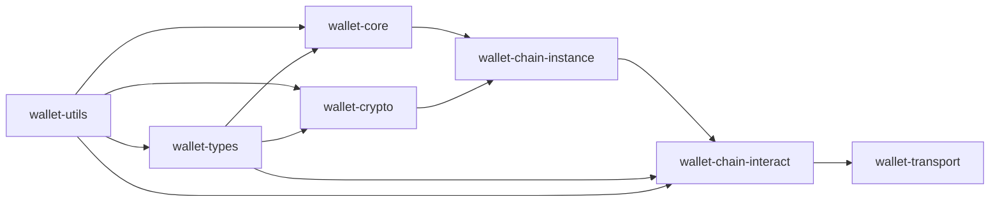

# Architecture

This repository is a multi-crate wallet workspace. The code is organized by
concern rather than by end-user feature.

## Layering

## Crate Roles

### `wallet-utils`

Shared helpers used across the workspace:

- logging and tracing
- parsing and conversion helpers
- hex, unit, and address helpers
- file, time, and system utilities

### `wallet-types`

Shared domain data:

- chain codes and chain types
- address types and categories
- network kinds
- shared constants and value objects

### `wallet-core`

Core wallet primitives:

- mnemonic to seed and root key generation
- derivation traits
- keypair traits
- address generation traits
- language and xpriv helpers

### `wallet-crypto`

Keystore and crypto helpers:

- encrypted JSON generation and decryption
- KDF configuration
- keystore builders
- seed and phrase wallet wrappers

### `wallet-chain-instance`

Chain-specific keypair and address wiring:

- chooses the right chain implementation from a chain code
- derives keypairs from a seed and derivation path
- generates addresses for BTC, LTC, DOGE, ETH, BNB, SOL, SUI, TON, and TRX

### `wallet-chain-interact`

Chain interaction logic:

- providers for chain RPC and HTTP APIs
- transfer, multisig, and contract helpers
- protocol response models
- per-chain operations for Bitcoin-like chains, EVM chains, Solana, Sui,
  Tron, Ton, Litecoin, and Dogecoin

### `wallet-transport`

Transport wrappers used by the interaction layer:

- RPC client wrapper
- HTTP client wrapper
- request builder helpers
- transport errors and response models

## Typical Flow

1. Convert mnemonic material into a seed with `wallet-core`.
2. Use `wallet-chain-instance` to bind a chain code and address type.
3. Derive a keypair or generate an address.
4. Use `wallet-chain-interact` to query the chain and build a transaction.
5. Send requests through `wallet-transport`.

## Current Design Caveats

- Some APIs still panic on invalid input.
- Some modules depend on nightly features.
- Some chain flows still assume external RPC services or vendor SDK behavior.
- The design is useful for experimentation and integration work, but it is not
  yet a polished public SDK.
